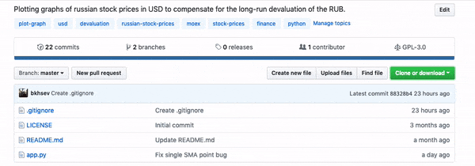

# RTUG
RTUG plots graphs of russian stock prices in USD (United States Dollar) to compensate for the long-run devaluation of the RUB (Russian Ruble).

## Why bother?  :grimacing:
Russian Ruble is a soft currency. Therefore, in the long-run it experiences devaluation. :chart_with_downwards_trend:	

> A **soft currency** is one with a value that fluctuates, predominantly lower, as a result of the country's political or economic uncertainty. 

If you are interested in buying stocks on russian stock market, devaluation makes it difficult to find businesses that are worth investing in.

### [Rosneft](https://en.wikipedia.org/wiki/Rosneft "Wikipedia") (Ticker: ROSN)

#### Below is a graph of ROSN in Russian Ruble. 
It is apparent that the firm has been growing and generally has a positive growth trend. :+1:
 


<p align="center"> ROSN, monthly, 30.06.2006 - 01.03.2019. Source: <a href="https://www.moex.com/ru/issue.aspx?board=TQBR&code=ROSN">MOEX</a></p>

#### Now here is a graph of ROSN in USD.
In fact, the firm is stagnating and has a negative growth trend. :-1: 
 

<p align="center"> ROSN, monthly, 30.06.2006 - 01.03.2019. Source: <a href="https://github.com/bkhsev/RTUG">RTUG</a></p>
 

So, stock charts in RUB (Russian Ruble) are usually misleading about the quality of the business. 

RTUG helps you visualise a more realistic picture. 
 
## Prerequisites
RTUG uses Python 2.7 and the following python modules:

#### Third-party modules
- dash
- plotly
- stockstats
- pandas 
- numpy
- datetime

#### Modules embedded in Python
(This modules do not require installation)
- urllib2 
- csv
- re


## Installation

1. Fork and clone the RTUG [repo](https://github.com/bkhsev/RTUG).

**Either**

In terminal,

`$ git clone https://github.com/bkhsev/RTUG.git`
 
 **Or**
 
 
 
 
 2. To set up your development/testing environment, run the following commands:
 
 ``` bash
# Move into the clone
$ cd RTUG
# Create a virtualenv
$ python2 -m venv venv
# Activate the virtualenv
$ . venv/bin/activate
# (On Windows, the above would be: venv\scripts\activate)
# Install required dependencies
$ pip install -r additional/requirements.txt
 ```
 
 You are set and ready to begin! :rocket:
